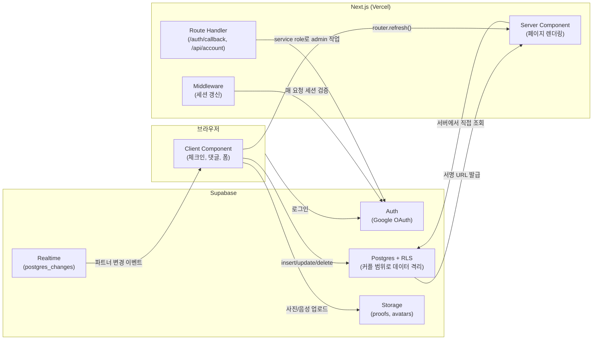

# 갓생커플

취준생·대학생 커플이 각자의 자기계발 루틴을 함께 인증하며 갓생을 사는 습관 트래커.


> 1인 개발 포트폴리오 프로젝트 — 기획부터 디자인, 프론트엔드, 배포까지 단독 수행
> 🔗 배포: [gatsaeng-couple.vercel.app](https://gatsaeng-couple.vercel.app)
> 📄 상세 기획서: [docs/기획서.md](docs/기획서.md)

## 스크린샷

<!-- TODO: 실제 화면 GIF/스크린샷으로 교체 -->
| 홈 대시보드 | 루틴 상세 · 캘린더 | 마이페이지 · 리캡카드 |
|---|---|---|
| _준비 중_ | _준비 중_ | _준비 중_ |

## 문제의식

기존 커플앱은 대화·일정 공유 중심이고, 습관 트래커는 개인 또는 불특정 다수 대상이라 커플 관계에 특화된 게이미피케이션이 비어 있습니다. 갓생커플은 "습관 형성 + 커플 관계"를 정면으로 결합해, 대학생·취준생 커플이 각자 다른 목표(토익 vs 운동)를 가지고 있어도 "함께 노력하는 시간"으로 묶어줍니다.

국내에 가장 근접한 경쟁 서비스는 "투투(TwoToo)"입니다 — 완전한 블루오션은 아니라는 점을 인지하고, 그 위에서 차별점을 좁혔습니다. 투투는 무엇이든 정해서 인증하는 범용 커플 챌린지 앱(iOS 전용, 통계 대시보드 약함)인 반면, 갓생커플은 **취준생·대학생의 자기계발**이라는 구체적 타깃 + 통계 대시보드 + 설치 없는 웹 기반으로 좁혀서 접근했습니다. 조사 과정과 전체 경쟁사 비교표는 [docs/기획서.md](docs/기획서.md) 3장 참고.

## 핵심 기능

**인증 · 연결**
- Google OAuth 로그인, 닉네임/프로필 사진 설정
- 초대코드 생성·공유(Web Share API)로 파트너 연결
- 이미 연결을 마친 사용자는 재로그인·재방문해도 온보딩 화면을 다시 거치지 않고 곧장 홈으로 진입
- 파트너 연결 해제 — 내 개인 루틴·기록은 남기고 공동/상대 루틴만 정리한 뒤, 같은 초대코드로 새 파트너와 재연결 가능
- 회원 탈퇴 시 내 루틴·인증기록·댓글·스토리지 파일까지 완전 삭제(파트너 데이터는 보존)

**루틴 · 체크인**
- 공동 루틴(둘 다 참여) / 개인 할 일(assignee 지정) 구분, 홈 화면에서 색상(공동·나·파트너)으로 한눈에 구분
- 반복 주기 설정: 매일 · 평일만 · 주말만 · 요일 커스텀
- 사진 · 텍스트 · 체크 3가지 인증 방식, 성공/실패 명시적 기록
- 루틴 수정·삭제, 성공 조건(둘 다 성공 / 한 명만 성공) 설정 — 개인 루틴 상세에는 파트너와의 성공률 비교 없이 본인 성공률만 표시
- 실패 시 노출되는 커플 벌칙 규칙

**스트릭 · 히스토리**
- 연속 성공일수(스트릭) · 최장 기록 계산, 목표일 기준 성공률
- 월별 캘린더 뷰 — 날짜 클릭 시 그날의 인증 기록과 댓글을 그 자리에서 확인
- 댓글에 텍스트 + 사진 + 음성 녹음(MediaRecorder) 첨부, 수정/삭제, 날짜 구분선
- Supabase Realtime으로 파트너의 체크인·댓글이 새로고침 없이 즉시 반영
- 브라우저 알림: 탭이 열려 있을 때 파트너 인증을 바로 알려줌

**마이페이지**
- 전체 성공률 · 최장 스트릭 · 함께한 루틴 · 이번 달 인증 통계
- 월간 리캡 카드 — 통계를 이미지로 캡처해 다운로드/공유(html-to-image)
- 시스템/라이트/다크 3단 테마 토글

## 기술 스택

| 영역 | 선택 |
|---|---|
| 프레임워크 | Next.js 15 (App Router) + TypeScript (strict) |
| 백엔드 | Supabase (Auth · Postgres + RLS · Storage · Realtime) |
| 스타일 | Tailwind CSS (다크모드는 CSS 변수 기반 `darkMode: "class"`) |
| 폼 | react-hook-form + zod |
| 기타 | html-to-image(리캡카드 캡처), fix-webm-duration(음성 녹음 메타데이터 보정) |
| 배포 | Vercel (`main` 브랜치 자동 배포) |

> TanStack Query·Zustand는 초기 스캐폴딩에 포함됐지만, 실제로는 Server Component에서 매 요청마다 새로 데이터를 가져오고 Realtime 구독 + `router.refresh()`로 동기화하는 방식만으로 충분해서 사용하지 않았습니다. 별도 클라이언트 상태 라이브러리 없이도 최신 상태를 유지할 수 있어 의도적으로 배제했습니다.

## 아키텍처



핵심 설계는 **RLS로 데이터 격리**하는 것입니다. 모든 테이블은 `auth.uid()`와 `get_my_partner_id()`(재귀 방지용 security definer 함수) 기준으로 "본인 또는 파트너"만 조회·수정 가능하게 제한되어 있어, 애플리케이션 코드에서 커플 범위를 따로 필터링하지 않아도 됩니다.

## 폴더 구조

```
src/
  app/
    login/                로그인
    connect/               파트너 연결(초대코드)
    profile/setup/          닉네임·프로필 사진 설정
    home/                   오늘의 루틴 체크인 대시보드
    routines/new/           루틴 생성
    routines/[id]/          루틴 상세 (스트릭·캘린더·댓글)
    routines/[id]/edit/      루틴 수정
    mypage/                  마이페이지·설정·회원탈퇴
    recap/                   월간 리캡 카드
    auth/callback/           OAuth 콜백 (PKCE code 교환)
    api/account/             회원 탈퇴 API (service role 사용)
  components/              Avatar, BottomNav, ThemeToggle, NotificationToggle 등 공용 컴포넌트
  lib/
    supabase/                브라우저/서버 Supabase 클라이언트
    types/                   DB 타입 정의
    streak.ts                스트릭·목표일 계산 로직
    date.ts                  KST 기준 날짜 계산 (자정 리셋 기준)
    notifications.ts         브라우저 알림 상태 관리
  middleware.ts            Supabase 세션 갱신
supabase/
  schema.sql                테이블 · RLS 정책 · 파트너 연결 RPC · Storage 정책
docs/
  기획서.md                 전체 기획 문서
  branch-strategy.md        브랜치 전략 & 커밋 컨벤션
```

## 로컬 개발 시작하기

```bash
npm install
cp .env.example .env.local   # 아래 3개 값 채우기
npm run dev
```

`.env.local`에 필요한 값 (Supabase 프로젝트 설정 > API에서 확인):

```
NEXT_PUBLIC_SUPABASE_URL=
NEXT_PUBLIC_SUPABASE_ANON_KEY=
SUPABASE_SERVICE_ROLE_KEY=   # 서버 전용, 회원 탈퇴 API에서만 사용
```

Supabase 프로젝트를 새로 만들었다면:
1. SQL Editor에서 `supabase/schema.sql` 실행 (테이블·RLS·RPC 생성)
2. Storage에서 `proofs`(비공개), `avatars`(공개) 버킷 수동 생성 — 버킷 자체는 대시보드에서만 만들 수 있음
3. Authentication > Providers에서 Google OAuth 설정, URL Configuration에 로컬/배포 도메인 등록

## 트러블슈팅

개발 중 겪은 문제와 해결 과정입니다.

- **Supabase 타입이 전부 `never`로 무너짐** — `Profile`/`Routine`/`CheckIn`을 `interface`로 선언했더니 암묵적 인덱스 시그니처가 없어 `supabase-js`의 `GenericSchema` 제약을 만족하지 못했음. `type`으로 바꾸고 `Relationships: []`를 추가해 해결.
- **RLS 정책 무한 재귀 (Postgres 42P17)** — `profiles` 정책이 `profiles` 테이블을 다시 조회하는 서브쿼리를 가지고 있어 재귀 발생. `get_my_partner_id()` security definer 함수로 우회.
- **Google 로그인 후 세션이 안 생김** — PKCE flow의 `code`를 세션으로 교환하는 `/auth/callback` Route Handler 자체가 없었음. 추가 후 해결.
- **자정이 지나도 체크인 상태가 초기화 안 됨** — "오늘" 계산에 `new Date().toISOString()`(항상 UTC)을 써서, 한국 자정~오전 9시 사이엔 실제로는 새 날인데 서버 기준으론 여전히 전날이었음. UTC+9를 명시적으로 더하는 `todayKST()`로 통일.
- **새 npm 패키지 설치 후 `next dev`가 알 수 없는 에러를 뱉음** — 개발 서버가 켜진 채로 `node_modules`/`.next` 상태가 바뀌면 캐시가 깨짐. `.next` 삭제 후 재시작으로 해결(동시에 여러 `npm run dev`를 띄우면 같은 문제가 재발하니 주의).
- **녹음한 음성 댓글이 0:00/0:00으로 재생 안 됨** — `MediaRecorder`가 만드는 webm에는 duration 메타데이터가 없는 크롬의 알려진 이슈. `fix-webm-duration`으로 녹음 종료 시 실제 길이를 헤더에 기록해 해결.
- **배포 후 로그인에서 `Invalid API key`** — Vercel 환경변수에 anon key를 잘못 붙여넣음. `/auth/callback`이 에러를 삼키고 무조건 `/login`으로만 보내던 것도 함께 고쳐서, 이후엔 실패 사유가 화면에 바로 보이도록 개선.
- **`develop` 브랜치가 통째로 사라짐** — PR 머지 화면에서 뜨는 "Delete branch"를 `develop`에도 눌러버림. `main`에 이미 내용이 다 있어서 그 지점에서 다시 만들어 복구. `feature/*`처럼 일회성 브랜치만 지우고 `main`/`develop`은 지우지 않기로 정리.
- **로그인할 때마다 파트너 연결 화면으로 다시 돌아감** — `/auth/callback`이 로그인 성공 시 무조건 `next=/profile/setup`으로 리다이렉트하도록 박혀 있어서, 이미 파트너 연결까지 끝낸 사용자도 재로그인할 때마다 프로필설정 → 초대코드 화면을 다시 거쳤음. 콜백과 랜딩 페이지에서 `profiles.partner_id`/`nickname` 완료 여부를 확인해 상태에 맞는 페이지(`/home` · `/connect` · `/profile/setup`)로 분기하도록 수정.

## 로드맵

기획서 9장(10~14일 로드맵) 기준 MVP 기능과, 이후 4장의 스트레치 기능(다크모드 · 리캡카드 · 브라우저 알림)까지 모두 구현하고 Vercel에 배포 완료했습니다. 진행 상황은 GitHub PR 히스토리로 추적 가능합니다.

향후 고려 중인 것:
- 이메일/비밀번호 로그인(현재는 Google OAuth만 지원)
- 댓글 첨부 파일 용량 제한 및 압축
- PWA로 전환해 실제 백그라운드 푸시 알림 지원
